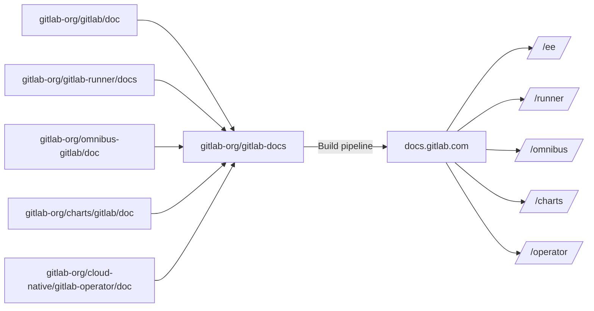

# Docs site architecture

While the source of the documentation content is stored in the repositories for
each GitLab product, the source that is used to build the documentation
site _from that content_ is located at <https://gitlab.com/gitlab-org/gitlab-docs>.

The following diagram illustrates the relationship between the repositories
from where content is sourced, the `gitlab-docs` project, and the published output.



GitLab docs content isn't kept in the `gitlab-docs` repository.
All documentation files are hosted in the respective repository of each
product, and all together are pulled to generate the docs website:

- [GitLab](https://gitlab.com/gitlab-org/gitlab/-/tree/master/doc)
- [Omnibus GitLab](https://gitlab.com/gitlab-org/omnibus-gitlab/-/tree/master/doc)
- [GitLab Runner](https://gitlab.com/gitlab-org/gitlab-runner/-/tree/main/docs)
- [GitLab Chart](https://gitlab.com/gitlab-org/charts/gitlab/-/tree/master/doc)
- [GitLab Operator](https://gitlab.com/gitlab-org/cloud-native/gitlab-operator/-/tree/master/doc)

Learn more about [the docs folder structure](https://docs.gitlab.com/ee/development/documentation/site_architecture/folder_structure.html).

## Assets

To provide an optimized site structure, design, and a search-engine friendly
website, along with a discoverable documentation, we use a few assets for
the GitLab Documentation website.

### External libraries

GitLab Docs is built with a combination of external:

- [JavaScript libraries](https://gitlab.com/gitlab-org/gitlab-docs/-/blob/main/package.json).
- [Ruby libraries](https://gitlab.com/gitlab-org/gitlab-docs/-/blob/main/Gemfile).

### SEO

- [Schema.org](https://schema.org/)
- [Google Analytics](https://marketingplatform.google.com/about/analytics/)
- [Google Tag Manager](https://developers.google.com/tag-platform/tag-manager)

## Global navigation

Read through [the global navigation documentation](https://docs.gitlab.com/ee/development/documentation/site_architecture/global_nav.html)
to understand:

- How the global navigation is built.
- How to add new navigation items.

## Pipelines

The pipeline in the `gitlab-docs` project:

- Tests changes to the docs site code.
- Builds the Docker images used in various pipeline jobs.
- Builds and deploys the docs site itself.
- Generates the review apps when the `review-docs-deploy` job is triggered.

### Pipeline configuration files

The `gitlab-docs` project pipeline configuration is split into multiple files to
improve maintainability:

- [`.gitlab-ci.yml`](https://gitlab.com/gitlab-org/gitlab-docs/-/blob/main/.gitlab-ci.yml):
  The base configuration file contains:
  - Global variables.
  - [`workflow:rules`](https://docs.gitlab.com/ee/ci/yaml/index.html#workflowrules)
    to limit which pipelines can run.
  - External templates imported with [`include`](https://docs.gitlab.com/ee/ci/yaml/index.html#include).
  - The other configuration files, also imported with `include`.
- [`.gitlab/ci/build-and-deploy.gitlab-ci.yml`](https://gitlab.com/gitlab-org/gitlab-docs/-/blob/main/.gitlab/ci/build-and-deploy.gitlab-ci.yml):
  The jobs that build the docs site before testing, and the jobs that deploy the site
  or review apps.
- [`.gitlab/ci/docker-images.gitlab-ci.yml`](https://gitlab.com/gitlab-org/gitlab-docs/-/blob/main/.gitlab/ci/docker-images.gitlab-ci.yml):
  The jobs that build and test docker images.
- [`.gitlab/ci/rules.gitlab-ci.yml`](https://gitlab.com/gitlab-org/gitlab-docs/-/blob/main/.gitlab/ci/rules.gitlab-ci.yml):
  The [`rules`](https://docs.gitlab.com/ee/ci/yaml/index.html#rules), [`cache`](https://docs.gitlab.com/ee/ci/yaml/index.html#cache)
  and other default configuration for most jobs in the pipeline.
- [`.gitlab/ci/security.gitlab-ci.yml`](https://gitlab.com/gitlab-org/gitlab-docs/-/blob/main/.gitlab/ci/security.gitlab-ci.yml):
  Extra configuration for security jobs to override their defaults and make them work
  better in the pipeline.
- [`.gitlab/ci/test.gitlab-ci.yml`](https://gitlab.com/gitlab-org/gitlab-docs/-/blob/main/.gitlab/ci/test.gitlab-ci.yml):
  Code tests and jobs used for [`gitlab-docs` maintenance](https://about.gitlab.com/handbook/product/ux/technical-writing/#regularly-scheduled-tasks).

### Rebuild the docs site Docker images

Once a week on Mondays, a scheduled pipeline runs and rebuilds the Docker images
used in various pipeline jobs, like `docs-lint`. The Docker image configuration files are
located in the [Dockerfiles directory](https://gitlab.com/gitlab-org/gitlab-docs/-/tree/main/dockerfiles).

If you need to rebuild the Docker images immediately (must have maintainer level permissions):

WARNING:
If you change the Dockerfile configuration and rebuild the images, you can break the main
pipeline in the main `gitlab` repository as well as in `gitlab-docs`. Create an image with
a different name first and test it to ensure you do not break the pipelines.

1. In [`gitlab-docs`](https://gitlab.com/gitlab-org/gitlab-docs), go to **{rocket}** **CI/CD > Pipelines**.
1. Select **Run pipeline**.
1. See that a new pipeline is running. The jobs that build the images are in the first
   stage, `build-images`. You can select the pipeline number to see the larger pipeline
   graph, or select the first (`build-images`) stage in the mini pipeline graph to
   expose the jobs that build the images.
1. Select the **play** (**{play}**) button next to the images you want to rebuild.

### Deploy the docs site

Every hour a scheduled pipeline builds and deploys the docs site. The pipeline
fetches the current docs from the main project's main branch, builds it with Nanoc
and deploys it to <https://docs.gitlab.com>.

To build and deploy the site immediately (must have the Maintainer role):

1. In [`gitlab-docs`](https://gitlab.com/gitlab-org/gitlab-docs), go to **{rocket}** **CI/CD > Schedules**.
1. For the `Build docs.gitlab.com every hour` scheduled pipeline, select the **play** (**{play}**) button.

Read more about [documentation deployments](https://docs.gitlab.com/ee/development/documentation/site_architecture/deployment_process.html).

## Archived documentation banner

A banner is displayed on archived documentation pages with the text `This is archived documentation for
GitLab. Go to the latest.` when either:

- The version of the documentation displayed is not the entry for `current` in
  `content/versions.json`.
- The documentation was built from the default branch (`main`).

For example, if the entries for `content/versions.json` are:

```json
[
  {
    "next": "15.5",
    "current": "15.4",
    "last_minor": ["15.3", "15.2"],
    "last_major": ["14.10", "13.12"]
  }
]
```

In this case, the archived documentation banner isn't displayed:

- For 15.4, the docs built from the `15.4` branch. The branch name is the entry in `current`.
- For 15.5, the docs built from the default project branch (`main`).

The archived documentation banner is displayed:

- For 15.3.
- For 14.10.
- For any other version.

## Bumping versions of CSS and JavaScript

Whenever the custom CSS and JavaScript files under `content/assets/` change,
make sure to bump their version in the front matter. This method guarantees that
your changes take effect by clearing the cache of previous files.

Always use Nanoc's way of including those files, do not hardcode them in the
layouts. For example use:

```erb
<script async type="application/javascript" src="<%= @items['/assets/javascripts/badges.*'].path %>"></script>

<link rel="stylesheet" href="<%= @items['/assets/stylesheets/toc.*'].path %>">
```

The links pointing to the files should be similar to:

```erb
<%= @items['/path/to/assets/file.*'].path %>
```

Nanoc then builds and renders those links correctly according with what's
defined in [`Rules`](https://gitlab.com/gitlab-org/gitlab-docs/blob/main/Rules).

## Linking to source files

A helper called [`edit_on_gitlab`](https://gitlab.com/gitlab-org/gitlab-docs/blob/main/lib/helpers/edit_on_gitlab.rb) can be used
to link to a page's source file. We can link to both the simple editor and the
web IDE. Here's how you can use it in a Nanoc layout:

- Default editor: `<a href="<%= edit_on_gitlab(@item, editor: :simple) %>">Simple editor</a>`
- Web IDE: `<a href="<%= edit_on_gitlab(@item, editor: :webide) %>">Web IDE</a>`

If you don't specify `editor:`, the simple one is used by default.

## Algolia search engine

The docs site uses [Algolia DocSearch](https://docsearch.algolia.com/)
for its search function.

Learn more in <https://gitlab.com/gitlab-org/gitlab-docs/-/blob/main/doc/docsearch.md>.
